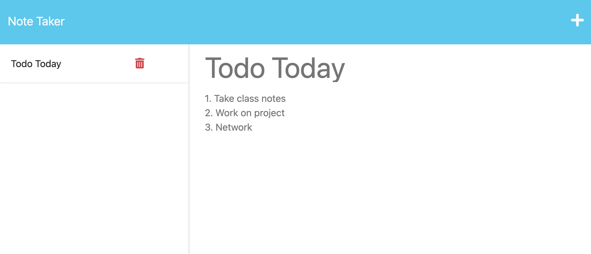
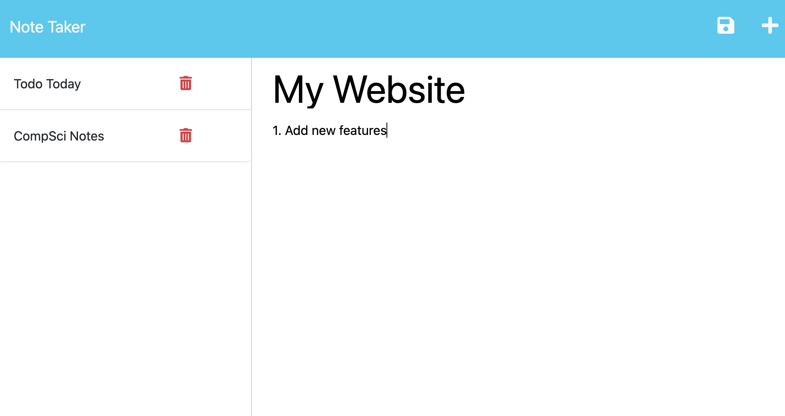

# Express.JS Note Taker App

## Description
This Note-Taking Application is a web-based tool that enables users to create, save, and manage their notes directly in their web browser. It utilizes a local database to ensure that notes are securely stored and easily accessible whenever needed. Users can create new notes by entering a title and content, view all saved notes in a list format, and delete notes they no longer require. Built with <b>Express.js</b> and <b>Node.js</b>, the application leverages the file system for persistent storage, ensuring that data is retained even after closing the browser.


## Table of Contents

- [Description](#description)
- [Home](#home)
- [Features](#features)
- [Technologies Used](#technologies-used)
- [Installation](#installation)

## Home





## Features

### **Feature 1**: Create Notes.

Users can easily create new notes by entering a title and content. The application provides a straightforward form for inputting your thoughts and ideas.

### **Feature 2**: View Notes.

All saved notes are displayed in a list format, allowing users to quickly browse through their entries.

### **Feature 3**: Delete Notes.

Users have the ability to delete notes they no longer need, ensuring that their note collection remains relevant and clutter-free.

### **Feature 4**: Persistent Storage.

The application uses a local database to save notes, meaning that your data is retained even after closing the browser. You can open the application at any time to access your saved notes.


## Technologies Used

- **Language**: JavaScript, HTML, CSS
- **Database**: JSON locally stored
- **Other Libraries/Tools**: Node.JS, Express.JS, FS (File System), UUID

## Installation

1. Clone the repository:
   ```bash
   git clone https://github.com/santos-al/ExpressJS-AS-M11.git
2. Install Dependencies:
   ```bash
   npm i
3. Start Application:
   ```bash
   npm run start
